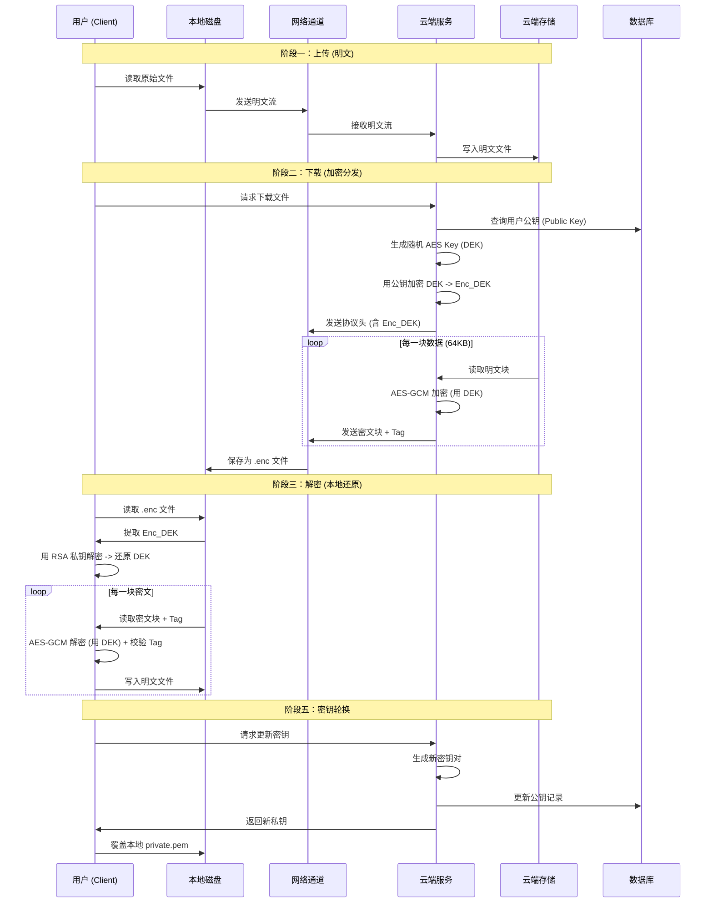

# 混合非对称加密系统：全流程深度解析报告

本报告详细梳理了系统的核心工作流、数据流转路径以及密钥生命周期。系统设计目标为 **“云端明文存储，下云安全分发”**，采用 RSA-4096 与 AES-256-GCM 混合架构。

`简而言之：`

`非对称密钥加密对称密钥，对称密钥加密数据`

`发送用户的是加密后的对称密钥和被对称密钥加密后的数据`

`用户本地使用非对称密钥的私钥先解密对称密钥，然后再用对称密钥解密数据`

---

## 1. 核心实体与密钥资产

在流程开始前，需明确系统中的关键实体及其持有的资产：

| 实体 (Entity) | 角色 | 持有密钥 (Keys) | 职责 |
| :--- | :--- | :--- | :--- |
| **Client (WebUI/CLI)** | 用户终端 | **私钥 (Private Key)**   `private.pem` | 上传原始数据、解密下载数据、管理本地文件 |
| **Server (Docker)** | 云端服务 | **公钥 (Public Key)**   `public.pem` (In DB) | 接收/存储明文数据、实时加密分发数据 |
| **Users DB** | 鉴权中心 | 用户名/密码哈希 | 验证用户身份，关联用户与其公钥 |

---

## 2. 阶段一：系统初始化 (System Setup)

在任何数据传输发生前，系统必须建立信任基石。

1.  **密钥生成** (`gen_keys.py`)：
    *   **操作**：利用 `cryptography` 库生成一对 RSA-4096 密钥。
    *   **分发**：
        *   **公钥 (Public Key)** -> 部署至服务端 (`server/app/keys/public.pem`) 并存入数据库。
        *   **私钥 (Private Key)** -> 部署至客户端 (`client/resources/private.pem`)。
        *   *注：私钥必须严格保密，仅留在用户本地。*
2.  **服务启动**：
    *   服务端从数据库加载公钥。
    *   客户端（如 WebUI）启动时检查本地私钥是否存在。

---

## 3. 阶段二：安全上云 (Secure Upload)

此阶段的目标是将用户数据传输至云端进行存储或分析。根据需求定义，**云端存储为明文**。

### 流程步骤：

1.  **用户操作**：用户在 WebUI 登录后，选择文件 `report.pdf` 并点击“上传”。
2.  **建立连接**：客户端向服务端 `/upload` 接口发起 HTTP POST 请求。
    *   *鉴权*：HTTP Basic Auth (User/Pass)。
3.  **数据传输**：
    *   **数据形态**：**原始明文流 (Plaintext Stream)**。
    *   **传输协议**：HTTP (生产环境建议 HTTPS 以防止上传过程被窃听)。
4.  **云端处理**：
    *   服务端接收文件流。
    *   **操作**：直接将数据流写入 Docker 容器的磁盘路径 `server_uploads/report.pdf`。
    *   *结果*：云端现在拥有一份完整的**明文**文件副本。

---

## 4. 阶段三：安全下云 (Secure Download & Distribution)

此阶段是本系统的核心安全环节。当数据需要从云端分发回本地（或分发给其他持有私钥的终端）时，系统实施**“实时信封加密”**。

### 流程步骤：

1.  **用户操作**：用户在 WebUI 点击“下载 `report.pdf`”。
2.  **请求发起**：客户端向服务端 `/download?filename=report.pdf` 发起请求。
3.  **服务端处理 (实时加密)**：
    *   **Step 3.1: 准备密钥**
        *   服务端生成一个随机的 **32字节 AES 会话密钥 (DEK)**。
        *   服务端生成一个随机的 **12字节 基础初始向量 (Base IV)**。
    *   **Step 3.2: 封装密钥 (Key Encapsulation)**
        *   服务端从数据库查询该用户的 **RSA 公钥**。
        *   使用 **RSA 公钥** 对 DEK 进行加密。
        *   *产物*：`Encrypted_DEK` (长度 512 字节)。
    *   **Step 3.3: 构造协议头**
        *   构建 **HENC 协议头**：包含 Magic、版本、Base IV、Encrypted_DEK 等元数据。
        *   将协议头作为响应流的第一部分发送给客户端。
    *   **Step 3.4: 流式数据加密 (Payload Encryption)**
        *   服务端打开磁盘上的明文文件 `report.pdf`。
        *   **循环读取**：每次读取 64KB 数据块。
        *   **动态计算 Nonce**：`Nonce = Base IV XOR (Block_Index)`。
        *   **AES-GCM 加密**：使用 DEK 和 Nonce 对数据块进行加密，生成 `Ciphertext` 和 `Auth Tag`。
        *   **发送**：将 `Ciphertext + Tag` 写入响应流。
    *   *数据流向*：`[HENC Header] -> [EncBlock 1] -> [EncBlock 2] ... -> Client`
    *   *安全状态*：此时在网络上传输的数据是完全加密的。没有私钥的攻击者无法解密，也无法篡改（会被 GCM Tag 校验拦截）。

---

## 5. 阶段四：本地解密 (Local Decryption)

数据到达客户端后，需要还原为明文以供使用。

### 流程步骤：

1.  **接收数据**：WebUI 将下载的加密流保存为临时文件 `report.pdf.enc`。
2.  **用户操作**：用户在 WebUI 本地模块选择该文件进行解密。
3.  **客户端处理 (解密引擎)**：
    *   **Step 3.1: 解析协议头**
        *   读取文件头部，提取 **Base IV** 和 **Encrypted_DEK**。
    *   **Step 3.2: 还原密钥**
        *   客户端读取本地的 **RSA 私钥**。
        *   使用私钥解密 `Encrypted_DEK`，还原出原始的 **AES 会话密钥 (DEK)**。
    *   **Step 3.3: 流式数据解密**
        *   **循环读取**：读取 `Block Size + 16` (密文+Tag) 的数据块。
        *   **动态计算 Nonce**：使用与服务端相同的逻辑 `Nonce = Base IV XOR (Block_Index)`。
        *   **AES-GCM 解密**：使用 DEK、Nonce、Tag 对密文块进行解密。
        *   *验证*：GCM 算法会自动校验 Tag。如果数据在传输中被篡改，解密将失败并抛出异常。
    *   **Step 3.4: 写入磁盘**
        *   将解密后的明文数据块写入 `report_decrypted.pdf`。
4.  **结果交付**：解密完成，用户可以直接打开明文文件。

---

## 6. 阶段五：密钥轮换 (Key Rotation)

当私钥泄露或定期更新时，执行此流程。

### 流程步骤：

1.  **用户发起**：用户在 WebUI 的 "Key Management" 页面点击 "Rotate Key Pair"。
2.  **服务端处理** (`/rotate-keys`)：
    *   生成全新的 RSA-4096 密钥对 (New_Pub, New_Priv)。
    *   **更新数据库**：将 `New_Pub` 和 `New_Priv` (仅备份记录) 更新到 `users` 表。
    *   **返回私钥**：将 `New_Priv` 作为响应返回给客户端。
3.  **客户端处理**：
    *   将旧的 `private.pem` 重命名为 `private.pem.bak`。
    *   将收到的 `New_Priv` 写入新的 `private.pem`。
4.  **生效**：下次下载时，服务端将使用数据库中的 `New_Pub` 加密，客户端使用本地的 `New_Priv` 解密。旧的私钥无法解密新下载的文件。

---

## 7. 数据与密钥流转总结图

